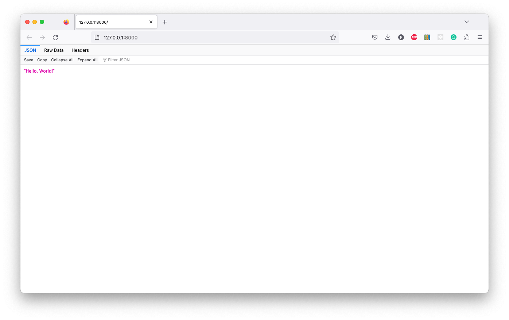

# Project Setup

## Poetry init

Create a new Poetry project:

```shell
poetry init
```

-   I'm going to call this project `my_api`
-   Starting at version `0.1.0`
-   My description will be: `Web API for plotting the magical Mandelbrot set.`
-   I am: `Freddy Wordingham <freddy@digilab.co.uk>`
-   I'm not going to add a license
-   Compatible with Python versions `3.8` and above
-   And I'm not going to add any dependencies right now

This will generate a [`pyproject.toml`](./pyproject.toml) file containing the project metadata.

We're not creating a library, so we can remove the `packages` attribute from the `pyproject.toml` file.

## Add .gitignore

I'm going to add a [`.gitignore`](./.gitignore) file to my project.
Python projects use a lot of files that we don't want to commit to Git, so we can use a template to generate a `.gitignore` file for us.

I'm going to pull the code from https://www.toptal.com/developers/gitignore/api/python into a `.gitignore` file using the `curl` command:

```shell
curl -L https://www.toptal.com/developers/gitignore/api/python > .gitignore
```

Alternatively, you can go to [gitignore.io](https://gitignore.io/) and generate a template more tailored to your needs.

## Add dependencies

We're going to need a few dependencies to get started.
`FastAPI` is the framework we're going to use to build the application, and `uvicorn` is a web server that we'll use to run the application.

```shell
poetry add fastapi
poetry add uvicorn
```

## Add API

Create an `api` directory to contain the code for the `FastAPI` application.

```shell
mkdir api
```

Then create a [`main.py`](./api/main.py) file to contain the code for the application.

```shell
touch api/main.py
```

In [`main.py`](./api/main.py), we'll add some code to create a `FastAPI` application.
First, we'll `import FastAPI`.
Then we'll instantiate an `app` object.
Finally, we'll add a `GET` route to the path "/" that returns a string saying "Hello, world!".

```python
from fastapi import FastAPI


app = FastAPI()


@app.get("/")
async def splashpage():
    """
    Splash page for the API.
    """

    return f"Hello, World!"
```

---

**NOTE**

The `async` keyword is used to mark functions that can be run asynchronously.
Asynchronous functions can be run in parallel and can be used to improve the performance of web applications.

---

## Try it

We can run the application by running the following command:

```shell
poetry run uvicorn api.main:app --reload --port 8000
```

This will start a web server on port 8000.
We can visit http://localhost:8000/ to see the application running.

We should see the string `"Hello, World!"`.



## Return

[Return to the top-level README](./../../README.md)
