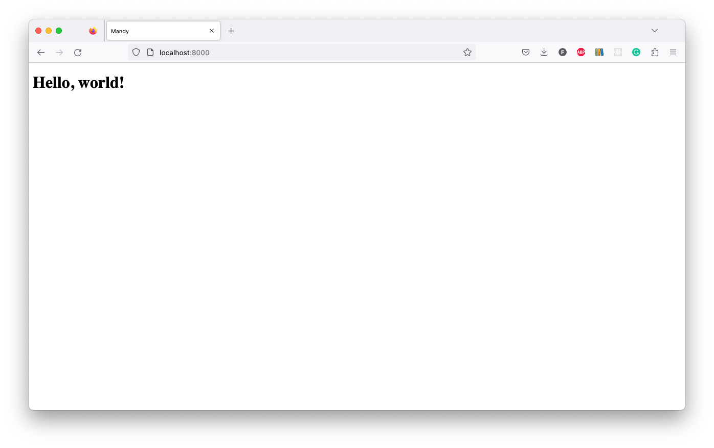

# HTML

## HTML response

Let's change the splashpage route ("\\") in [`main.py`](api/main.py) so that it returns the text in a `<h1>Hello, world!</h1>` tag:

```python
from fastapi.responses import HTMLResponse # This should go at the top of the file

@app.get("/", response_class=HTMLResponse)
async def splashpage():
    """
    Splash page for the API.
    """

    return "<h1>Hello, world!</h1>"
```

Now when we run the application and visit http://localhost:8000/, we'll see the formatted text.

## Add dependencies

It would be a bit tedious to write HTML in Python strings, so we're going to use a templating framework to render our HTML.
We're going to use the `jinja2` package to do this.

```shell
poetry add jinja2
```

---

**NOTE**

`Jinja2` is a popular and powerful templating engine for `Python`.
It is widely used in web development frameworks such as `FastAPI` to generate dynamic `HTML` pages, emails, and other types of text-based content.

`Jinja2` uses a simple and intuitive syntax that allows developers to separate the presentation of their content from its underlying data.
It provides a way to define reusable templates that can be customized for different use cases, without requiring developers to write repetitive code.

`Jinja2` supports a wide range of features, including conditional statements, loops, filters, and macros, that make it easy to build complex templates.
It also has support for internationalization and localization, making it a good choice for multilingual applications.

Overall, `Jinja2` is a powerful tool that makes it easy for developers to build dynamic and customizable content for web applications and other types of software.

---

## Add templates

Create a `templates` directory to contain the `HTML` templates for the application.

```shell
mkdir templates
```

Then create a [`base.html`](templates/base.html) file to contain the metadata for the `HTML` pages that won't change from page to page.

```shell
touch templates/base.html
```

This is what the `base.html` file should look like:

```html
<!DOCTYPE html>
<html lang="en">
    <head>
        <meta charset="UTF-8" />
        <title>Mandy</title>
        <meta name="viewport" content="width=device-width, initial-scale=1" />
    </head>
    <body>
         
    </body>
</html>
```

Then create a [`index.html`](templates/index.html) file to hold the content for the splashpage.

```shell
touch templates/index.html
```

This is what the `index.html` file should look like:

```html
 

<h1>Hello, world!</h1>


```

## Add settings

We need to tell `FastAPI` where to find the templates.
We'll create a [`settings.py`](api/settings.py) file to hold the settings for the application:

```shell
touch api/settings.py
```

And within this file, we'll add the following code:

```python
from fastapi.templating import Jinja2Templates


TEMPLATES = Jinja2Templates(directory="templates")
```

Next, we'll need to import the `settings` module in [`main.py`](api/main.py).
We're also going to import the `Request` class from `FastAPI` so that we can pass it to the template.

```python
from fastapi import FastAPI, Request
from fastapi.responses import HTMLResponse

import mandybrot as mandy

from . import settings
```

## Update splashpage route

Now we can update the splashpage route in [`main.py`](api/main.py) to use the `Jinja2` templates:

```python
@app.get("/", response_class=HTMLResponse)
async def splashpage(request: Request):
    """
    Splash page for the API.
    """

    return settings.TEMPLATES.TemplateResponse("index.html", {"request": request})
```

## Try it

We can run the application by running the following command:

```shell
poetry run uvicorn api.main:app --reload --port 8000
```

And then visit http://localhost:8000/, we'll see the splashpage rendered from the `HTML` template.



## Return

[Return to the top-level README](./../../README.md)
