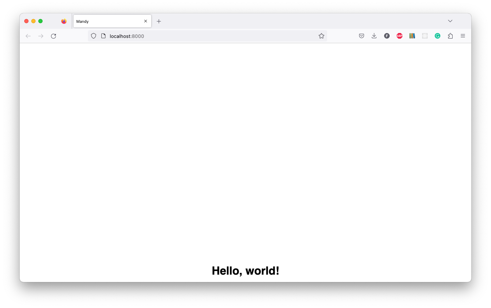

# CSS

If we want to add some style to our HTML, we can use CSS.
It is cleaner to have the CSS code contained in a separate `style.css` file.

We'll add a directory for static resource files, and we'll create our stylesheet within it.
Then we'll need to tell FastAPI that we want to serve static files from that directory.

## Static Files

We'll create a `static` folder at the root of our project:

```shell
mkdir static
```

Then create a `style.css` file inside it:

```shell
touch static/style.css
```

## Add CSS

Within [`style.css`](./static/style.css), we'll add the following code:

```css
body {
    font-family: "Roboto", sans-serif;
    background-size: cover;
}

.container {
    display: flex;
    justify-content: center; /* align horizontally */
    align-items: end; /* align vertically */
    height: 100vh;
}
```

This tells all of the text on the page to use the `Roboto` font, and to use a background image that will cover the entire page.
**Note** we haven't added the background image yet, we'll do that in a later section.

We also create a class called `container`.
This class is a `flexbox` container, which means that it will automatically align its children horizontally and vertically.
We use `justify-content` to align the children horizontally, and `align-items` to align them vertically.

## Link CSS

Update the [`base.html`](./templates/base.html) file to link to the `CSS` file:

```html
<head>
    ...
    <link rel="stylesheet" href="/static/style.css" />
</head>
```

## Add container to base

Update the [`base.html`](./templates/base.html) file to wrap all the `content` in a `container` class:

```html
<body>
    <div class="container"> </div>
</body>
```

# Update FastAPI

We need to tell FastAPI that we want to serve static files from the `static` directory.
First, in [`main.py`](./api/main.py) import the `StaticFiles` class:

```python
from fastapi.staticfiles import StaticFiles
```

And then just beneath `app = FastAPI()`, add following code:

```python
app.mount("/static", StaticFiles(directory="static"), name="static")
```

## Try it

We can run the application by running the following command:

```shell
poetry run uvicorn api.main:app --reload --port 8000
```

And then visit http://localhost:8000/, we'll see the splashpage rendered from the HTML template.



## Return

[Return to the top-level README](./../../README.md)
