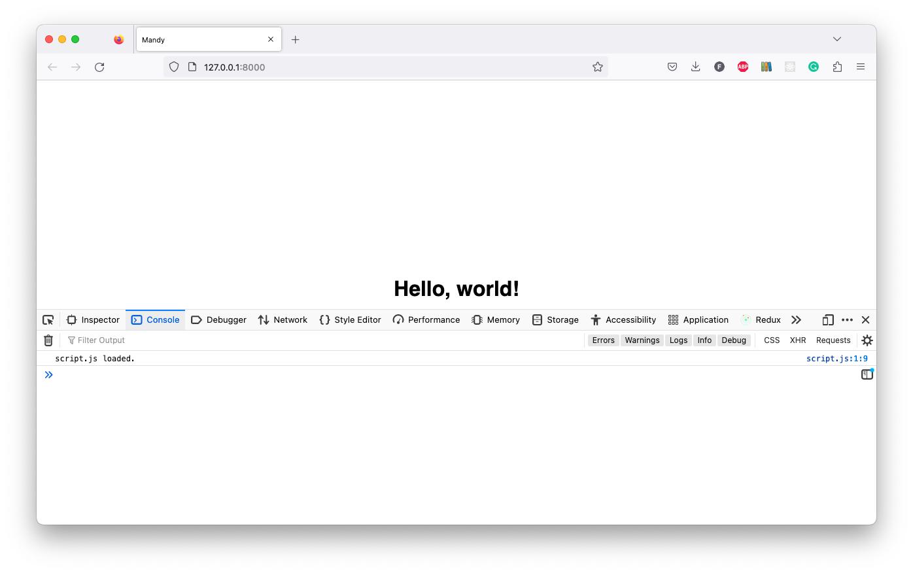
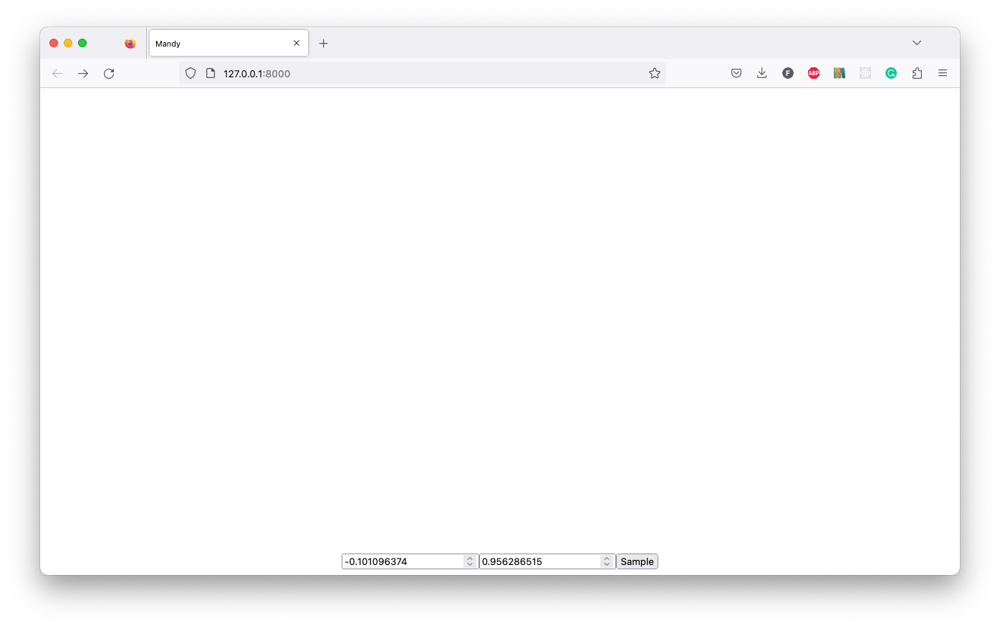

# JavaScript

Next we'll add some inputs to our page, ready to sample the API.

## Add script.js

In the `static` folder, create a new file called [`script.js`](./static/script.js):

```shell
touch static/script.js
```

Then add the following code:

```js
console.log("script.js loaded.");
```

## Link script.js

Update the [`base.html`](./templates/base.html) file to link to the `script.js` file:

```html
<head>
    ...
    <script src="/static/script.js"></script>
</head>
```

If you run the app now, you should see the message `"script.js loaded."` in the browser console:



## Add inputs

In [`base.html`](./templates/index.html) file replace `<h1>Hello, world!</h1>` with the following code:

```html
<input type="number" id="real_input" name="number" value="-0.101096374" />
<input type="number" id="imag_input" name="number" value="0.956286515" />
<button onClick="sample()">Sample</button>
```

## Add sample function

Back within [`script.js`](./static/script.js) file, add the following code to the start of the file:

```js
function sample() {
    const real = document.getElementById("real_input").value;
    const imag = document.getElementById("imag_input").value;

    const url = `http://localhost:8000/sample/${real}/${imag}`;
    window.location = url;
}
```

This function will get the values from the inputs, and then redirect the browser to a page showing the result of the API call.

## Try it out

Run the app:

```bash
poetry run uvicorn app.main:app --reload --port 8000
```

Navigate to http://localhost:8000/ and try entering some numbers into the inputs.
You should see the browser redirect to the API endpoint, and the number of iterations displayed.



After which you should see the browser redirect to the API endpoint, and the number of iterations displayed:


## Return

[Return to the top-level README](./../../README.md)
